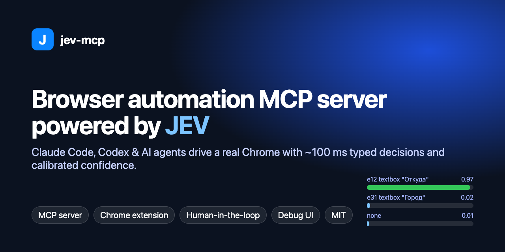
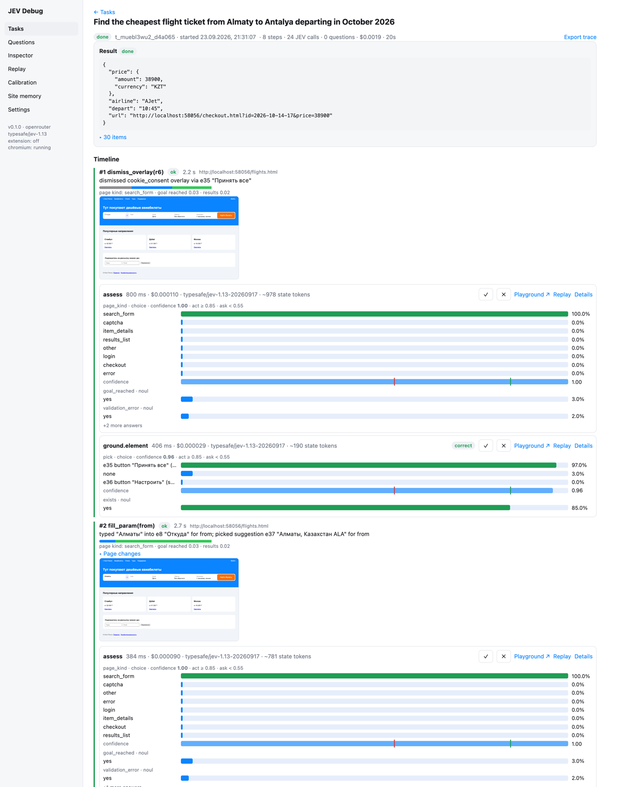
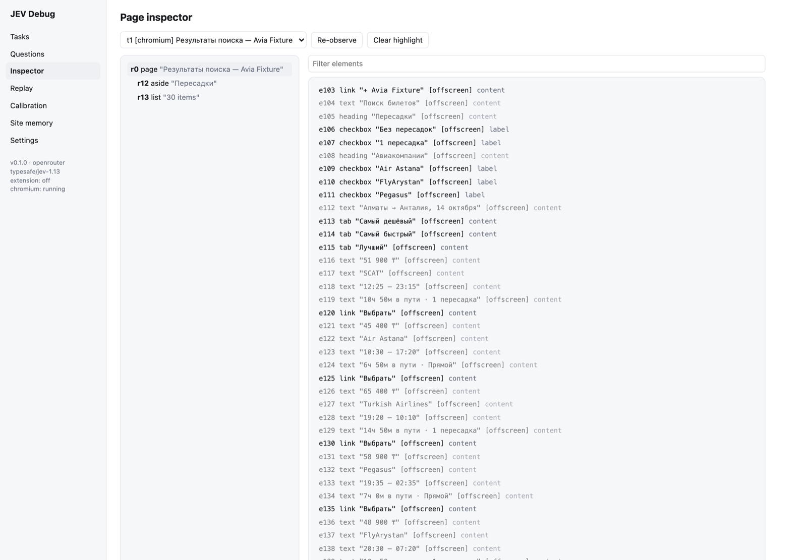
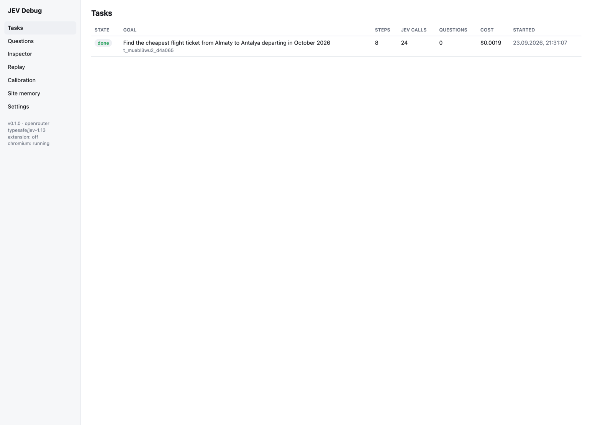

# jev-mcp — browser automation MCP server powered by JEV

<p align="center"></p>

<p align="center">
  <a href="https://legostin.github.io/jev-mcp/">Website</a> ·
  <a href="LICENSE"></a>
  
  
  
</p>

**jev-mcp** is a [Model Context Protocol](https://modelcontextprotocol.io) (MCP) server that lets **Claude Code, Codex and any MCP-capable AI agent drive a real Chrome browser** using **JEV**, [TypeSafe AI](https://typesafe.ai)'s *System One* decision model. JEV answers typed questions such as "which element is the departure-city input?" or "did that click work?" in about 100 ms. Each answer comes with a **calibrated confidence**, so the tool acts on its own when it is sure and asks your agent when it is not.

> Your agent plans. JEV executes: fast, cheap and transparent. Every decision is traced and can be replayed.

<p>
  <a href="#quick-start">Quick start</a> ·
  <a href="#mcp-tools">MCP tools</a> ·
  <a href="#how-it-works">How it works</a> ·
  <a href="#confidence-and-human-in-the-loop">Confidence</a> ·
  <a href="#safety">Safety</a> ·
  <a href="#debugging-and-observability">Debugging</a> ·
  <a href="#troubleshooting">Troubleshooting</a> ·
  <a href="#faq">FAQ</a>
</p>

---

## Why JEV for browser agents

Usual LLM browser agents send a screenshot or a huge DOM dump to a frontier model on every step. That is slow and expensive, and the model still guesses. JEV is different:

| | Frontier LLM agent | jev-mcp with JEV |
|---|---|---|
| Decision latency | 2–20 s per step | **~100 ms** per decision |
| Cost | cents per step | **$0.042 per million input tokens**, output free |
| Output | free text you have to parse | **typed** choice / score / yes-no, never malformed |
| Uncertainty | overconfident | **calibrated probabilities** that drive act / verify / ask |
| Your agent's context | fills up with HTML and screenshots | compact, filtered page views |

JEV does not write text or plan, and that is the point. **Your agent (Claude, GPT, Codex) stays the planner.** jev-mcp turns the page into a clean model, and JEV makes the many small decisions: which element, which autocomplete suggestion, whether a cookie wall blocks the page, whether a step succeeded.

### Measured results

**Airline-search fixture** (`fixtures/sites/flights.html`, a local imitation of a real airline-search site): Russian UI, a consent wall, an autocomplete, a low-fare calendar and "show more" pagination. The task was "cheapest flight Almaty → Antalya in October":

```
step 1 dismiss_overlay   accepted the cookie consent wall
step 2 fill_param(from)  typed "Алматы", picked suggestion "Алматы, Казахстан ALA"
step 3 fill_param(to)    typed "Анталия", picked suggestion "Анталия, Турция AYT"
step 4 pick_date         opened the calendar, chose the cheapest October day (code computes the minimum)
step 5 submit            safety check, then "Найти билеты"
step 6 apply_sort        the site's own "cheapest first" sorting
step 7 results           the sorted list goes to the agent (or, with extract "code", min(price) = 38 900 ₸)
= 7 steps · 20 JEV calls · 0 questions to the agent · $0.0015 · 16 s
```

- **Grounding eval.** 58 labelled cases over 10 fixture sites cover distractor fields, unlabeled inputs, shadow DOM, cross-origin iframes, "not on this page" cases and param steps: filter chips, values that exist only inside dropdown lists, price fields. Top-1 accuracy is **100%**, median decision time 0.44 s, and the confidence is well calibrated (expected calibration error **0.05**).
- **Filter pages without questions.** On a car-marketplace filters fixture (value chips, dropdown lists, sorting), "cheapest Toyota Camry in Павлодар" (chips) and "cheapest Lexus RX 350 in Караганда" (values only in dropdowns) each finish in 6 steps, about 17 JEV calls and 0 questions; the sorted list, with cheaper accessories on top, goes to the agent.
- **Live international sites** (jev's own Chrome, first runs, no hints):
  - a code-hosting repository search, "most starred repository for a query": query, search, the site's "sort by stars", 10 results handed over: 4 steps, 7 JEV calls, 0 questions, 10 s;
  - a news aggregator's search, "most popular story about a topic from the past month": the date range picked in a custom dropdown, 30 results handed over: 5 steps, 12 JEV calls, 0 questions, 17 s;
  - a large marketplace that chose a Russian UI by itself, "cheapest new pair of given headphones": search first, then the "New" condition filter on the results page ("Новый" matched to "New"), price sorting, the list of parts and headphones handed over for the agent to tell apart: 6 steps, 12 JEV calls, 0 questions.

<p align="center"></p>

## Features

- **MCP server for Claude Code, Codex, Cursor and other clients.** Async tasks that never block your agent.
- **Two browser modes on one CDP engine:**
  - **your own Chrome** through the jev Chrome extension (`chrome.debugger`), with your logins and a side panel;
  - **jev's own Chrome/Chromium profile**, headful or headless, for background jobs and CI.
- **Page understanding built for decision models:**
  - DOM snapshot, accessibility tree, layout and paint order;
  - regions: forms, lists, overlays, popups, dialogs;
  - stable element refs (`e12`) across re-renders;
  - element names from labels, placeholders and nearby text, which fixes unlabeled React inputs;
  - occlusion detection (`[covered]`, `[BLOCKING]`);
  - shadow DOM and cross-origin iframes.
- **Autonomous task loop:**
  - dismisses consent and promo overlays, and works through dialogs that are a step of the goal (payment, plan choice);
  - fills fields from your params and picks autocomplete suggestions;
  - handles date pickers, including low-fare calendars;
  - submits, paginates and extracts results to your schema with `min/max/first/all`.
- **Human-in-the-loop by confidence.** When JEV is unsure, the agent gets a question with the candidates and their probabilities. The question arrives through Claude Code channels, `jev watch`, an appendix to every tool result, or `jev_wait`.
- **Fully configurable confidence thresholds:** global, per domain, per task and live. Presets or exact values; `escalate: 0` means "never ask on low confidence".
- **Safety:**
  - irreversible actions (pay, order, send, delete) always need confirmation;
  - secret params never reach the model;
  - hidden text and prompt-injection bait are dropped from the page model;
  - domain allow-lists and budgets.
- **Observability:**
  - every step, JEV request, probability distribution and timing lands in a local SQLite trace;
  - one-click "open this decision in the TypeSafe playground";
  - calibration reports that recommend thresholds.
- **Site memory.** The tool learns which element serves which purpose on each site, so repeat runs are faster and more confident.
- **Providers:** [OpenRouter](https://openrouter.ai/typesafe/jev-1.13) (`typesafe/jev-1.13`) or the official TypeSafe API (`jev-latest`), with optional failover.

## Quick start

Requirements: macOS or Linux, Node.js ≥ 22.18, Google Chrome (or Chromium), and an API key for [OpenRouter](https://openrouter.ai/typesafe/jev-1.13) or the [TypeSafe API](https://console.typesafe.ai).

```bash
git clone https://github.com/legostin/jev-mcp.git
cd jev-mcp
npm install
npm run build:web                              # builds the Chrome extension (dist/extension) and the debug UI (dist/ui)
node bin/jev.mjs install                       # registers the MCP server in Claude Code and Codex, links the skill and the `jev` CLI
jev settings set providers.openrouter.apiKey - # paste the key, press Enter, then Ctrl-D; stored in ~/.config/jev-browser/config.json (0600)
jev doctor                                     # checks the key, JEV latency, Chrome and the extension
```

`jev install` links the CLI to `~/.local/bin/jev`. If `jev` is not found, add `~/.local/bin` to your `PATH` or run `node bin/jev.mjs …`.

To use the official TypeSafe API instead of OpenRouter:

```bash
jev settings set provider typesafe
jev settings set providers.typesafe.apiKey -
```

You never start the daemon yourself. The first MCP call or `jev` command starts it, and it exits after 30 minutes without clients or tasks. `jev stop` stops it immediately.

### Use with Claude Code

`jev install` registers the server as `claude mcp add -s user jev-browser -- node <repo>/bin/jev.mjs mcp`. It becomes available in **new** Claude Code sessions; check it with `claude mcp list`. Then ask Claude:

> Find the cheapest flight from Almaty to Antalya in October

Claude calls `jev_task` and keeps working while JEV runs. Questions from JEV reach Claude in three ways:

1. **Pushed into the session.** Start Claude Code with
   `claude --dangerously-load-development-channels server:jev-browser`
   (channels are in research preview and need a claude.ai login). Questions then arrive as `<channel source="jev-browser" …>` events.
2. **Background watcher.** Claude runs `jev watch <task_id>` in the background. It exits on the next question or when the task finishes, which wakes Claude.
3. **Always on.** Any jev tool result ends with the pending questions, and `jev_wait` blocks for up to 55 s.

The `jev-browser` skill (linked into `~/.claude/skills`) teaches Claude how to write tasks and answer questions.

### Use with Codex and other MCP clients

`jev install` adds `[mcp_servers.jev-browser]` to `~/.codex/config.toml` and links the skill into `~/.agents/skills`. Any other client can run `node <repo>/bin/jev.mjs mcp` over stdio. Questions arrive through tool results and `jev_wait`.

### Choose the browser

| Driver | What it is | When to use |
|---|---|---|
| `extension` | Your everyday Chrome, driven through the jev extension | Sites with logins, bot checks or CAPTCHAs; when you want to watch or take over |
| `chromium` (visible) | jev's own Chrome window with a separate, persistent profile | Default when the extension is not connected |
| `chromium` (headless) | The same profile without a window (`jev settings set driver.chromium.headless true`) | Background jobs and CI. Many travel and shopping sites show a CAPTCHA to headless browsers. |

`driver.default` is `auto`: it uses the extension when it is connected and jev's Chrome otherwise. A task or tool call can override this with `driver: "extension" | "chromium"`.

### Connect your own Chrome (extension)

1. Get the extension: use `dist/extension` after `npm run build:web`, or download `jev-extension-*.zip` from [Releases](https://github.com/legostin/jev-mcp/releases) and unzip it.
2. Open `chrome://extensions`, turn on **Developer mode**, click **Load unpacked** and pick the folder. The extension id is `ggdonbkfnfociekejpgdbkagbelpoceb`; `jev install` allow-lists it.
3. Run `jev pair`. It prints a 6-digit code valid for 10 minutes. Click the JEV toolbar icon to open the side panel and enter the code.
4. The side panel shows **connected**. `jev doctor` now reports `extension: connected`.

While jev controls a tab, Chrome shows a "JEV Browser started debugging this browser" bar; that is expected. The side panel lists tasks and pending questions, and has **Pause**, **Take over**, **Resume**, **Cancel**, a live confidence slider and element highlighting. If you click or type in a task's tab yourself, the task pauses until you resume it.

The extension talks only to `ws://127.0.0.1:47913` (`driver.extensionPort`; the side panel has a port field if you change it). Tasks on extension tabs pause while the extension is disconnected and resume when it reconnects.

### Update or remove

```bash
git pull && npm install && npm run build:web   # then click "Reload" on the extension in chrome://extensions
jev stop                                       # the next call starts the new version
jev uninstall                                  # removes the MCP registrations, skill links and CLI link (keeps settings and traces)
```

## MCP tools

| Tool | What it does |
|---|---|
| `jev_task` | Starts an autonomous browser task: goal, site, params, result, policy. Returns immediately; the results list comes back to your agent to read. |
| `jev_status` · `jev_wait` · `jev_result` | Follow a task: progress, the next question or completion, extracted items. |
| `jev_answer` | Resolves a JEV question: `pick`, `hint`, `set_param`, `thresholds`, `continue`, `skip`, `abort`; `remember` saves it to site memory. |
| `jev_control` | Pause, resume, cancel, or update params, hints and thresholds of a running task. |
| `jev_observe` | Compact page view: region overview, one region, one element, diff since the last look. |
| `jev_find` | Free-text element search ranked by JEV, with probabilities and an "exists at all?" score. |
| `jev_ask` | Your own typed JEV questions (noul / choice / score) about the current page. |
| `jev_act` | One trusted action (click, type, select, check, press, scroll, navigate…) by ref or by intent. |
| `jev_tabs` · `jev_screenshot` | Tab management and vision fallback. |
| `jev_trace` | Why JEV did what it did: steps, calls, answers, costs, playground links. |
| `jev_settings` · `jev_doctor` | Settings (keys are write-only) and diagnostics. |

Example task:

```json
{
  "goal": "Find the cheapest flight ticket from Almaty to Antalya departing in October 2026",
  "site": "https://flights.example.com",
  "params": {
    "from":   { "value": "Алматы",  "about": "departure city" },
    "to":     { "value": "Анталия", "about": "destination city" },
    "period": { "value": { "from": "2026-10-01", "to": "2026-10-31" }, "about": "departure date" }
  },
  "result": { "select": "min(price)" },
  "policy": { "confidence": { "preset": "balanced" }, "irreversible": "ask" }
}
```

## How it works

```
Claude Code / Codex ──stdio──▶ jev mcp            (thin proxy, one per agent session)
                                  │ JSON-RPC over a 0600 unix socket
                                  ▼
                        jevd — one daemon per machine
   task runner · perception engine · JEV client · site memory · trace store · debug UI
                                  │ Chrome DevTools Protocol (flat sessions)
                   ┌──────────────┴──────────────┐
          extension driver                chromium driver
      (your Chrome, side panel)     (own profile, headless/headful)
```

Each task step:

1. **Observe.** The page settles (DOM quiet, network idle, pending timers done). Then a snapshot of DOM, accessibility tree and paint order is turned into a page model with regions and stable refs.
2. **Assess.** One batched JEV call answers: page kind, overlay kinds, goal reached, results present, validation errors, missing required fields.
3. **Decide.** Code rules pick the sub-intent: dismiss overlay, fill param, pick suggestion, pick date, submit, extract, load more. JEV chooses only when the rules cannot.
3a. **Find the way in.** If the page's form does not lead to the goal (a site search when the goal is to post an ad), or the page has no form and nothing to fill while the goal is clearly not reached (a home page when you are already signed in), the task opens the part of the site where the goal is done ("Post an ad", "Sell", the account and its menu item), with the usual effect check and rollback. An opener it already took is never clicked again. "Goal reached" means the outcome: for an action (post, pay, book, send) only a confirmation counts, not a page where it can still be done.
4. **Ground.** JEV gets a card for the current step with its value ("set the car model to "Camry"") instead of every param, and only the hints that belong to this step. One call asks for the control that shows the value and, as a fallback, for the field or list opener where the param is chosen. Selection is hierarchical (region, then element) with an "exists?" check. A mid-range answer gets a second look at the top candidates, shown with the row they sit in ("Модель | [Camry] | RAV4"); both looks are averaged, not overwritten. A leader whose label is exactly the value acts without a second look. Site memory offers a fast path.
5. **Safety gate.** Code rules and JEV classify the action; irreversible steps ask first.
5a. **Multi-step forms.** Wizard steps without anything to fill go on ("Next", or "Skip" for optional steps); inactive step tabs are recognised; with `policy.fill_required: "any"`, required choices you gave no param for get the option that fits the goal and hints best (the saved card), else the first. A dialog that is part of the goal (a payment, a plan or card choice, a confirmation) is worked through, not closed: its choices are filled and its own button goes on.
6. **Act and verify.** Trusted CDP input, deterministic checks and a JEV verification. Reversible steps (fields, chips, dropdowns, date pickers, "more filters", sorting, overlays) check their effect; when it is missing, the step is rolled back (history back, Escape, restore the value, re-click a toggle) and the next candidate is tried.

Everything numeric is computed in code: prices, date ranges, minima. JEV's weak spots (arithmetic, counting, dates) are [documented by TypeSafe](https://docs.typesafe.ai/model-jaggedness/jev-1.13), so JEV only makes semantic judgments.

## Who reads the results

JEV is a fast judge of the page, not a reader of long lists. A task with `result` stops on the results: it applies the site's own sorting for `select: "min(field)"` / `"max(field)"` (so the answer is on the first page), finds the page's main results list, and hands it to your agent as one line per item:

```
Results page: "Sony Wh-1000xm5 for sale" https://shop.example/sch?... (sorted on the site by price, lowest first)
  0. Replacement ear pads for Sony WH-1000XM5 | $9.99 | Brand new → https://shop.example/itm/1
  1. Sony WH-1000XM5 Wireless Noise Canceling Headphones, Black | $248.00 | Brand new → https://shop.example/itm/2
```

The agent picks the answer: it tells headphones from ear pads, sponsored rows from results and odd currencies from prices far better than field-by-field parsing. The list stays within about 4k tokens; `result.pages` reads more pages first. For bulk collection, `result.extract: "code"` parses items by `result.schema` in code and applies `select` (numbers, dates and minima computed exactly).

## Confidence and human in the loop

Every JEV decision has a calibrated confidence. For each decision kind (`assess`, `subintent`, `ground`, `verify`, `extract`) there are two thresholds:
- **`act`:** at or above it, jev-mcp acts;
- **`escalate`:** below it, jev-mcp asks your agent.

In between, it takes a second, independent look.

| Preset | choice act / escalate | noul yes / no |
|---|---|---|
| `cautious` | 0.90 / 0.70 (+ margin 0.30) | 0.85 / 0.15 |
| `balanced` (default) | 0.85 / 0.55 | 0.80 / 0.20 |
| `autonomous` | 0.60 / 0.20 | 0.65 / 0.35 |

Thresholds can be set at four levels, each overriding the previous:
1. globally (`jev settings set confidence.preset autonomous`);
2. per domain (`domains.<host>.confidence`);
3. per task (`policy.confidence`);
4. live, while a task runs (`jev_control update`, a `thresholds` answer, or the side-panel slider).

Any value from 0 to 1 is allowed; `escalate: 0` disables confidence-driven questions. `jev calibrate` shows how accurate JEV was at each confidence level on your own traces and suggests thresholds.

### Trials: acting below 40% without guessing blindly

Low confidence often means a close call between two plausible controls, not a wrong one. For reversible steps jev-mcp does not ask right away: it acts on the best candidate if it leads "none of these" and is at least `trial.floor`, checks the effect, rolls back and tries the next one. Your agent gets a question only after `trial.tries` failed attempts (the question lists what was tried) or before anything irreversible. Submitting forms never uses trials.

| Preset | trial enabled / floor / tries |
|---|---|
| `cautious` | off |
| `balanced` (default) | on / 0.25 / 2 |
| `autonomous` | on / 0.15 / 3 |

`trial` sits in the same layers as the thresholds, e.g. `"policy": { "confidence": { "trial": { "floor": 0.2, "tries": 3 } } }` or `jev settings set confidence.trial.enabled false`.

Tasks survive a daemon restart: progress is checkpointed after every step (secrets masked), and an interrupted task continues with `jev_control resume` in a tab at its last address. Secret values are never written to disk: a secret the task has not used yet is dropped on restart, and the task asks for it again only if a page needs it (or give it back with `jev_control update`).

Hints are scoped too. A hint in a task spec applies everywhere. A hint given as an answer to a question about one step (and a `scope: "domain"` hint saved from it) is bound to that step and param: a hint about the body type filter reaches steps about the body type, not the model or the city.

## Safety

- **Irreversible actions ask first.** This covers pay, buy, order, book, send, subscribe, delete, publish and forms that collect card details, detected by code rules in English and Russian plus JEV. It applies at any confidence unless you set `policy.irreversible: "allow"`.
- **Secrets stay local.** Params marked `secret: true` are typed by code and masked everywhere. JEV sees only `[secret]`. The trace store refuses anything that looks like an API key.
- **Prompt-injection hygiene.** Hidden and `aria-hidden` text never enters the page model. Page text lives only in the JEV *state*, never in question instructions.
- **Local-only services.** The unix socket has 0600 permissions. The UI binds to 127.0.0.1 and needs a token. The extension WebSocket checks the `Origin` and requires a one-time pairing.
- **Budgets and limits** apply per task and per day: cost, steps and time.

## Debugging and observability

- `jev_trace` / `jev ui` shows a timeline of every step with its timings and each JEV call: state, questions, probability bars against your thresholds, model version, cost.
- An **"Open in TypeSafe Playground"** link for any decision replays it in the [TypeSafe console](https://console.typesafe.ai).
- The **replay** view edits a question or the state and re-runs it against JEV.
- **Calibration** shows reliability per template, estimated from verified steps and agent answers.
- `jev observe`, `jev find "<query>"` and `jev tabs` work from the terminal.

<p align="center">
  
  
</p>

## Development

```bash
npm test                 # unit + integration tests (headless Chrome, local fixture sites, offline JEV)
npm run test:live        # live tests against JEV (needs a key)
npm run eval             # decision-quality evals: accuracy and calibration per question template
npm run typecheck
node scripts/observe-fixture.ts flights.html   # print the perception output for a fixture page
```

The code is TypeScript and runs natively on Node's type stripping, so the daemon, MCP server and CLI need no build step. Fixture sites in `fixtures/sites/` imitate real-world difficulties: Russian labels, unlabeled inputs, consent walls, autocomplete, calendars, shadow DOM, cross-origin iframes, pagination.

## Troubleshooting

| Symptom | What to do |
|---|---|
| `jev doctor` shows `key: missing` or `jev` fails with `auth` | `jev settings set providers.openrouter.apiKey -` (or the `typesafe` provider). Check the key and credit at openrouter.ai. |
| A task asks a `blocker` question about a CAPTCHA or bot check | Solve it in the browser window, then answer `continue`. If the tab is headless, nobody can see it: cancel and rerun with `driver: "extension"` or `jev settings set driver.chromium.headless false`. |
| `extension: not connected` | Open the side panel and check its status. Run `jev pair` again if it says *unpaired*. Make sure nothing else uses port 47913. |
| A task paused with `user_takeover` | Someone clicked or typed in the task's tab. Resume it from the side panel, `jev_control resume` or the debug UI. |
| A task keeps asking the same `stuck` question | Look at the tab with `jev_observe` / `jev_screenshot` or open `jev ui`, then answer with a `hint`, act yourself with `jev_act` and answer `continue`, or `abort`. |
| JEV asks too often, or acts too eagerly | Lower or raise the thresholds (`confidence.preset`, `confidence.act` / `escalate`, per domain or per task), and check `jev calibrate`. |
| A task says `interrupted` after an update or restart | The daemon restarted. Its trace is kept (`jev_trace`); start the task again. |
| Something else | `jev doctor`, the daemon log at `~/.local/share/jev-browser/jevd.log`, and `jev ui` for the full decision trace. `jev stop` restarts the daemon on the next call. |

## FAQ

**What is JEV?** JEV is TypeSafe AI's first *System One* model. It returns typed decisions (choice, score, yes/no) with calibrated probabilities instead of generating text. See the [TypeSafe docs](https://docs.typesafe.ai/introduction) and the [OpenRouter guide](https://openrouter.ai/docs/guides/community/jev).

**Does it replace Playwright MCP or browser-use?** Those give an LLM low-level browser control, and every decision goes through the LLM. jev-mcp moves the many small decisions to JEV, 100× cheaper and faster, and keeps your agent for planning and ambiguity. You still get direct control through `jev_observe` / `jev_act`.

**Can it use my logged-in browser?** Yes, through the extension driver. Otherwise it uses its own persistent Chrome profile.

**Which languages?** Any. JEV is most accurate in English, so write goals and hints in English. Page text and param values stay as they are.

**How much does it cost?** JEV input costs $0.042 per million tokens and output is free. A typical multi-step task costs a fraction of a cent.

## Status and roadmap

All five stages of the design are implemented and tested:
1. core perception and the JEV client;
2. the autonomous task loop and MCP tools;
3. the Chrome extension driver with the side panel;
4. the debug UI;
5. site memory and calibration.

There are 111 automated tests, plus live tests and evals against JEV.

Next up:
- more real-site evals;
- a hosted gallery of anonymised traces;
- per-site hint packs;
- publishing to npm.

Issues and PRs are welcome.

## License

[MIT](LICENSE). JEV and TypeSafe are trademarks of TypeSafe AI. This project is an independent, community-built integration.

<!-- Keywords: MCP server, Model Context Protocol, browser automation, AI browser agent, Claude Code browser, Codex browser tool, Chrome automation, Chrome extension, Chrome DevTools Protocol, CDP, headless Chrome, web automation, web scraping, form filling, JEV, TypeSafe AI, System One model, OpenRouter, calibrated confidence, human-in-the-loop, agentic AI -->
